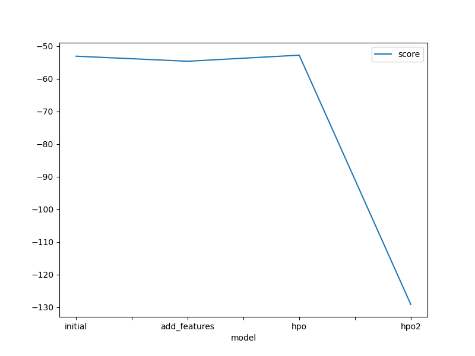

# Report: Predict Bike Sharing Demand with AutoGluon Solution
#### ROGER NOBUYUKI KAMOI

## Initial Training
### What did you realize when you tried to submit your predictions? What changes were needed to the output of the predictor to submit your results?
In my case I was able to submit the answers directly but there is the need to check and set negative values to zero if any.

### What was the top ranked model that performed?
The top ranked model was WeightedEnsemble_L4

## Exploratory data analysis and feature creation
### What did the exploratory analysis find and how did you add additional features?
In the exploratory data analsys I was able to see the features distribution in the histogram chart, also could check the data maximum, minimum, average, mean and standard values with the describe function. To add aditional features I split the date value into the features day, month and year.

### How much better did your model preform after adding additional features and why do you think that is?
In my case after adding the features day, month and year, it didn't improved much, probably because these features were not stongly corelated with the target value.

## Hyper parameter tuning
### How much better did your model preform after trying different hyper parameters?
The model had the best performance and improvement after working with hyper parameter tunning, I added the hiperparameters  num_bag_folds, num_stack_levels and also added hyperparameter values for neural network models (NN_TORCH) and hyperparameter values for lightGBM gradient boosted trees (GBM).

### If you were given more time with this dataset, where do you think you would spend more time?
I would probably explore better AutoGluon documentation and check what actions could help improve the accuracy of the model, if adding more features, what hiperparameters to work on.

### Create a table with the models you ran, the hyperparameters modified, and the kaggle score.
|model|hpo1|hpo2|hpo3|hpo4|score|
|--|--|--|--|--|--|
|initial|raw data||||1.80758|
|add_features|raw data|added features day, month and year|||1.78684|
|hpo|raw data|added features day, month and year|hyperparameters num_bag_folds and num_stack_levels||1.78166|
|hpo2|raw data|added features day, month and year|hyperparameters num_bag_folds and num_stack_levels|hyperparameters for neural network (NN_TORCH) and lightGBM gradient boosted trees (GBM)|1.31721|

### Create a line plot showing the top model score for the three (or more) training runs during the project.

### Create a line plot showing the top kaggle score for the three (or more) prediction submissions during the project.

## Summary
In this project we were able to predict the bike sharing demand Kaggke use case using AutoGluon library. 

The first prediction was done with raw data resulting in a score of 1.80758

After that we worked on some data engineering adding three features; day, month and year extracting them from the column "datetime". This model did not improve much, this path could be explored more adding other features derived from other columns and we could use the correlation map to help on that (see the notebook last map). This second run ended with a score of 1.78684, with a marginal gain.

The third run of the model was done with two higher level hyperparameters num_bag_folds and num_stack_levels, which didn't result in much gain also, resulting in a score of 1.78166.

The last run was made with models hyperparameters for NN_TORCH and GBM which result in the most significant improvement over the last results, wiht a score of 1.31721.

Hyperparameters seems to be the most usefull tunning although feature engineering was little explored in the project, and both could be explored more.

Each execution result in a different best model, where WeightedEnsemble_L3 was the model for the first and second run, WeightedEnsemble_L4 for the run with the higher level hyperparameters and WeightedEnsemble_L2 the best model for the last hyperparameter optimization.
